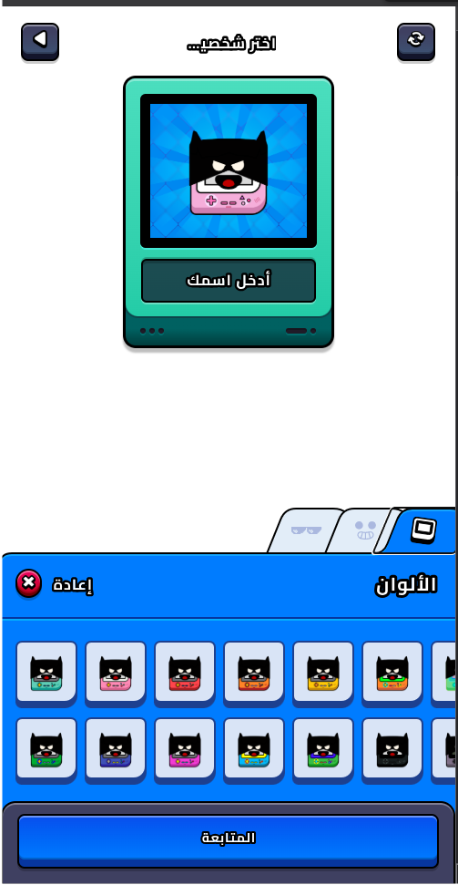
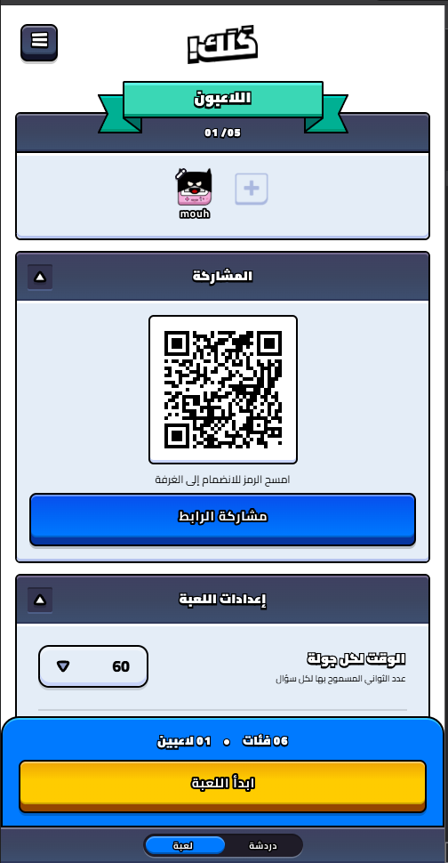
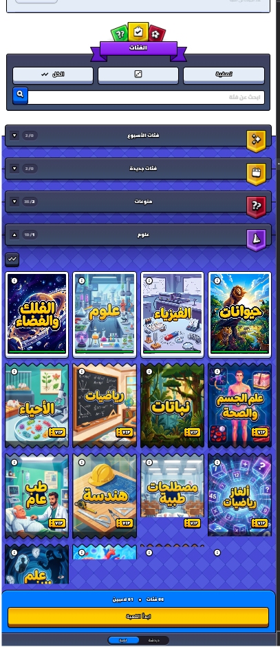
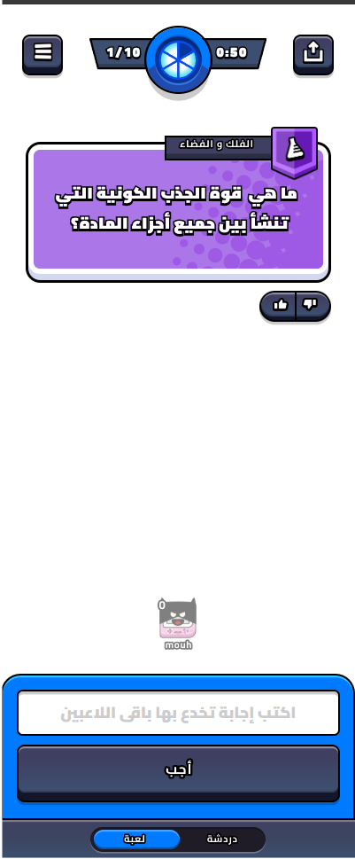
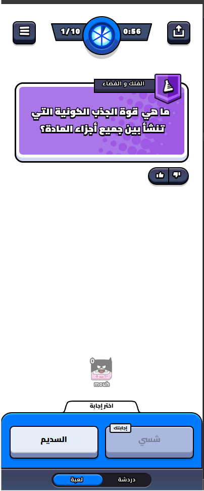
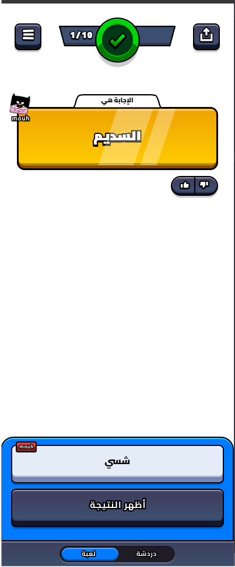
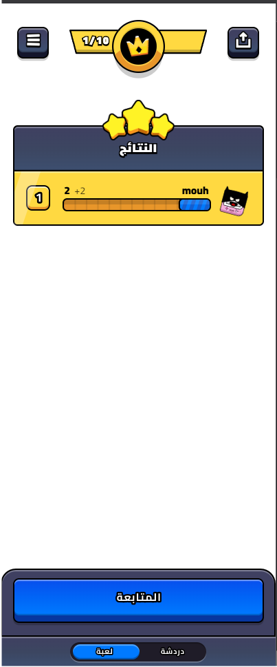

# 1: high [COMPLETED]
 
الثيم يجب أن يكون بهذا الشكمل و أيضا واجهة إختيار شخصية اللاعبو شكلها يجب ان تكون مشابهة 

# 2: high [COMPLETED]

أريد أن أيضا في جلسة لإنتاظر اللاعبين أن يكون خيار إستخدام الكاميرا لعمل سكان من داخل اللعبة أو عمل شار أو إملاء الرقم مباشرة 

# 3: high [COMPLETED]
أريد أن يمكن تعيين الوقت لكل جولة كم و هو عدد الثواني المسموح بها لكل سؤال 
و أيضا وضع الفرق تكتل لاعبين مع بعض ضد لاعبين 
و أيضا يمكن تعيين عدد لاعبين بالارقام مباشرة 
و أيضا تعيين عدد الجدولات 

# 4: high [COMPLETED] 

أريد أن يكون نظام الفئات بهذا الشكل و البيانات تدعم ذلك بالشكل المناسب ما أريده في backend هو أن يكون بهذا الشكل 
data/و من ثم داخلها يوجد مجلد من أجل كل فئة داخل المجرد يوجد ملفات من أجل كل نوع داخلي و كل نوع داخلي او صنف يوجد حزمة بيانات أسئلة و صور كاملة تخصه هذا هو هيكل البيانات الذي أريده 
 و الثيم بالطبع يجب ان يكون بهذا الشكل الإحترافي و الجيد للعب 
 

# 5: high [COMPLETED]

داخل اللعبة أريدها ان تكون بهذا الشكل أي نص أو صورة و نص فوق و من ثم في الأسفل الإجابة التي سيخدع بها اللاعبين 

بعد ذلك تظهر إجابات جميع الأعضاء و يمكن منها ان يختار اللاعب الإجابة التي يريد و يراها صحيحة

ثم تظهر بهذا الشكل إن كانت صحيحة 

ثم لوحة النتائج 
و هكذا حتى يفوز أحد ما 
